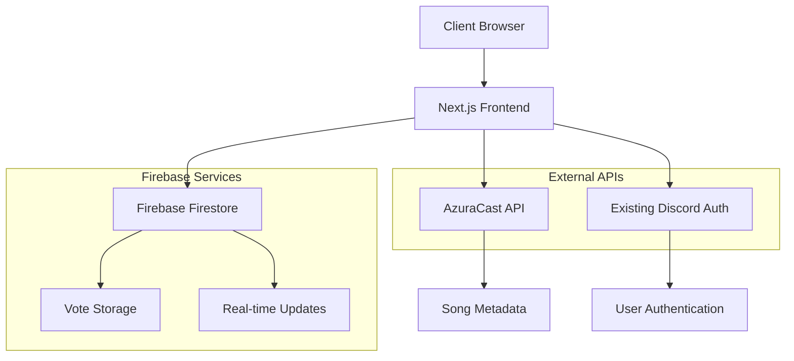

# Design Document

## Overview

The Discord Voting System is an elegant, real-time voting interface that allows Discord-authenticated users to vote on currently playing songs. The system integrates with the existing AzuraCast API for song information and uses Firebase for secure vote storage and real-time updates. The design leverages the existing authentication system and builds upon the current radio player architecture.

## Architecture

### High-Level Architecture



### Data Flow

1. **Song Information**: AzuraCast API provides current song metadata via existing SSE connection
2. **Authentication**: Existing Discord OAuth system provides user identity
3. **Vote Submission**: Client sends vote to Firebase with user ID and song ID
4. **Real-time Updates**: Firebase real-time listeners update vote counts across all clients
5. **Vote Persistence**: Firestore stores votes with user and song associations

## Components and Interfaces

### Core Components

#### 1. VotingInterface Component
- **Purpose**: Main voting UI with like/dislike buttons and vote counts
- **Props**: 
  - `currentSong: ClientSong | null`
  - `user: DiscordUser | null`
  - `isAuthenticated: boolean`
- **State**: 
  - `userVote: 'like' | 'dislike' | null`
  - `voteCount: { likes: number, dislikes: number }`
  - `isVoting: boolean`

#### 2. VoteButton Component
- **Purpose**: Individual vote button (like/dislike) with animations
- **Props**:
  - `type: 'like' | 'dislike'`
  - `isActive: boolean`
  - `count: number`
  - `onClick: () => void`
  - `disabled: boolean`

#### 3. SongVoteDisplay Component
- **Purpose**: Displays current song info with voting interface
- **Props**:
  - `song: ClientSong`
  - `voteData: VoteData`
  - `onVote: (type: 'like' | 'dislike') => void`

### Service Layer

#### 1. VotingService
```typescript
interface VotingService {
  // Submit or update a vote
  submitVote(songId: string, userId: string, voteType: 'like' | 'dislike'): Promise<void>;
  
  // Get current vote counts for a song
  getVoteCounts(songId: string): Promise<VoteCount>;
  
  // Get user's current vote for a song
  getUserVote(songId: string, userId: string): Promise<'like' | 'dislike' | null>;
  
  // Subscribe to real-time vote updates
  subscribeToVoteUpdates(songId: string, callback: (votes: VoteCount) => void): () => void;
}
```

#### 2. FirebaseVotingService (Implementation)
- Implements VotingService interface
- Handles Firestore operations
- Manages real-time subscriptions
- Ensures vote integrity (one vote per user per song)

### Hooks

#### 1. useVoting Hook
```typescript
interface UseVotingReturn {
  userVote: 'like' | 'dislike' | null;
  voteCount: VoteCount;
  isVoting: boolean;
  submitVote: (type: 'like' | 'dislike') => Promise<void>;
  error: string | null;
}

function useVoting(songId: string | null, userId: string | null): UseVotingReturn
```

#### 2. useFirebaseVotes Hook
```typescript
interface UseFirebaseVotesReturn {
  votes: VoteCount;
  userVote: 'like' | 'dislike' | null;
  loading: boolean;
  error: string | null;
}

function useFirebaseVotes(songId: string, userId: string | null): UseFirebaseVotesReturn
```

## Data Models

### Firebase Collections Structure

#### 1. Votes Collection (`/votes`)
```typescript
interface VoteDocument {
  id: string; // Auto-generated document ID
  songId: string; // AzuraCast song ID
  userId: string; // Discord user ID
  voteType: 'like' | 'dislike';
  timestamp: FirebaseTimestamp;
  songTitle: string; // Denormalized for analytics
  songArtist: string; // Denormalized for analytics
}
```

#### 2. Vote Aggregates Collection (`/vote-aggregates`)
```typescript
interface VoteAggregateDocument {
  id: string; // Same as songId
  songId: string;
  likes: number;
  dislikes: number;
  totalVotes: number;
  lastUpdated: FirebaseTimestamp;
  songTitle: string; // Denormalized
  songArtist: string; // Denormalized
}
```

### Client-Side Types

```typescript
interface VoteCount {
  likes: number;
  dislikes: number;
  total: number;
}

interface VoteData {
  userVote: 'like' | 'dislike' | null;
  counts: VoteCount;
  isLoading: boolean;
}

interface DiscordUser {
  id: string;
  username: string;
  avatar: string | null;
  discriminator: string;
}
```

## Error Handling

### Error Types and Handling Strategy

#### 1. Authentication Errors
- **Scenario**: User not authenticated when attempting to vote
- **Handling**: Show "Login to vote" message, disable voting buttons
- **User Experience**: Clear call-to-action to authenticate

#### 2. Network Errors
- **Scenario**: Firebase connection issues, API timeouts
- **Handling**: Retry logic with exponential backoff, offline state management
- **User Experience**: Loading states, error messages with retry options

#### 3. Vote Submission Errors
- **Scenario**: Duplicate votes, validation failures
- **Handling**: Client-side validation, server-side constraints
- **User Experience**: Immediate feedback, graceful error recovery

#### 4. Real-time Update Errors
- **Scenario**: WebSocket disconnections, subscription failures
- **Handling**: Automatic reconnection, fallback to polling
- **User Experience**: Seamless updates, connection status indicators

### Error Recovery Patterns

```typescript
// Retry pattern for vote submissions
const submitVoteWithRetry = async (songId: string, userId: string, voteType: VoteType) => {
  const maxRetries = 3;
  let attempt = 0;
  
  while (attempt < maxRetries) {
    try {
      await votingService.submitVote(songId, userId, voteType);
      return;
    } catch (error) {
      attempt++;
      if (attempt === maxRetries) throw error;
      await delay(Math.pow(2, attempt) * 1000); // Exponential backoff
    }
  }
};
```

## Testing Strategy

### Unit Testing

#### 1. Component Testing
- **VotingInterface**: Test vote submission, state updates, authentication states
- **VoteButton**: Test click handlers, visual states, animations
- **SongVoteDisplay**: Test song data display, vote integration

#### 2. Service Testing
- **VotingService**: Mock Firebase operations, test error handling
- **FirebaseVotingService**: Integration tests with Firebase emulator

#### 3. Hook Testing
- **useVoting**: Test state management, side effects, error handling
- **useFirebaseVotes**: Test real-time subscriptions, data synchronization

### Integration Testing

#### 1. Authentication Flow
- Test voting with authenticated and unauthenticated users
- Verify vote association with correct Discord user ID

#### 2. Real-time Updates
- Test vote count updates across multiple clients
- Verify subscription cleanup and memory management

#### 3. Song Changes
- Test voting state reset when songs change
- Verify proper cleanup of subscriptions

### End-to-End Testing

#### 1. Complete Voting Flow
- User authentication → song display → vote submission → real-time updates
- Test across different browsers and devices

#### 2. Error Scenarios
- Network disconnections during voting
- Firebase service unavailability
- Authentication token expiration

## Security Considerations

### Firebase Security Rules

```javascript
// Firestore Security Rules
rules_version = '2';
service cloud.firestore {
  match /databases/{database}/documents {
    // Votes collection - users can only create/update their own votes
    match /votes/{voteId} {
      allow read: if true; // Public read for vote counts
      allow create: if request.auth != null 
        && request.auth.uid == resource.data.userId
        && isValidVote(request.resource.data);
      allow update: if request.auth != null 
        && request.auth.uid == resource.data.userId
        && isValidVoteUpdate(request.resource.data, resource.data);
      allow delete: if false; // No vote deletion
    }
    
    // Vote aggregates - read-only for clients
    match /vote-aggregates/{songId} {
      allow read: if true;
      allow write: if false; // Only server functions can write
    }
  }
}

function isValidVote(data) {
  return data.keys().hasAll(['songId', 'userId', 'voteType', 'timestamp'])
    && data.voteType in ['like', 'dislike']
    && data.songId is string
    && data.userId is string;
}
```

### Client-Side Security

1. **Input Validation**: Validate all vote data before submission
2. **Rate Limiting**: Implement client-side rate limiting for vote submissions
3. **Authentication Checks**: Verify user authentication before enabling voting
4. **Data Sanitization**: Sanitize song metadata before storage

## Performance Optimizations

### Real-time Updates

1. **Connection Pooling**: Reuse Firebase connections across components
2. **Subscription Management**: Automatic cleanup of unused subscriptions
3. **Debouncing**: Debounce rapid vote changes to reduce Firebase writes

### Caching Strategy

1. **Vote Count Caching**: Cache vote counts with TTL for frequently accessed songs
2. **User Vote Caching**: Cache user's votes locally to reduce Firebase reads
3. **Optimistic Updates**: Update UI immediately, sync with server asynchronously

### Bundle Optimization

1. **Code Splitting**: Lazy load voting components when needed
2. **Firebase SDK**: Import only required Firebase modules
3. **Component Optimization**: Use React.memo for vote display components

## Integration Points

### Existing Systems Integration

#### 1. AzuraCast Integration
- **Current Song Data**: Use existing `useNowPlaying` hook for song information
- **Song Changes**: Listen to existing SSE stream for song transitions
- **Song ID Mapping**: Use AzuraCast song IDs as primary keys for votes

#### 2. Discord Authentication
- **User Identity**: Integrate with existing Discord OAuth system
- **User Data**: Use existing user context for Discord profile information
- **Authentication State**: Leverage existing authentication state management

#### 3. UI Integration
- **Design System**: Use existing Tailwind CSS classes and component patterns
- **Theme Integration**: Follow existing dark/light theme implementation
- **Responsive Design**: Match existing mobile-first responsive patterns

### API Endpoints (if needed)

```typescript
// Optional API routes for server-side operations
// GET /api/votes/[songId] - Get vote counts for a song
// POST /api/votes - Submit a vote
// GET /api/votes/user/[songId] - Get user's vote for a song
```